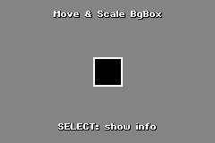

# canvas_bg_draw_box demo

A demo to show how to draw an arbitrary-sized box on the background.

To do this, `demo::BgBox` manages 4bpp `regular_bg` cells(map), tiles and palette in run-time.

## Pre-defined macros

1. `DEMO_BG_BOX_DEBUG`
    * If defined, show a debug mapping tiles.\
      You can toggle it with pressing **`L`**.
1. `DEMO_BG_BOX_PROFILER_ENABLED`
    * If defined with `BN_CFG_PROFILER_ENABLED=true`, runs a profiler.\
      To show profiler results, press **`R`**.
